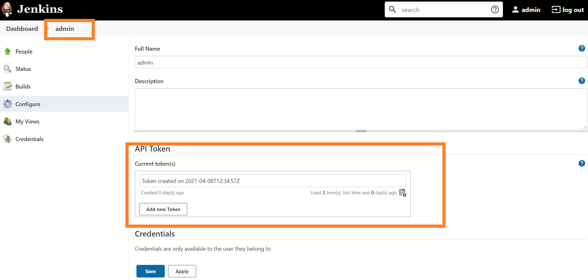

- [jenkins](#jenkins)
- [REST API](#rest-api)
- [Audit](#audit)
- [Jenkins code](#jenkins-code)

<small><i><a href='http://ecotrust-canada.github.io/markdown-toc/'>Table of contents generated with markdown-toc</a></i></small>

# jenkins
- Install

Slave Node:
```console
sudo apt update; sudo apt install -y openjdk-8-jdk
sudo useradd -m -s /bin/bash jenkins
sudo passwd jenkins
```

Master:
```console
sudo apt update; sudo apt install openjdk-8-jdk
java -version
wget -q -O - https://pkg.jenkins.io/debian-stable/jenkins.io.key | sudo apt-key add -
sudo sh -c 'echo deb http://pkg.jenkins.io/debian-stable binary/ > /etc/apt/sources.list.d/jenkins.list'
sudo apt update; sudo apt install jenkins
sudo systemctl start jenkins

# create pub key for slave
sudo su - jenkins
ssh-keygen -t rsa -b 2048
ssh-copy-id jenkins@172.16.150.12  #add pub key to authorized_keys on the slave

# adding docker 
sudo apt update; sudo apt install -y docker
vi /lib/systemd/system/docker.service
ExecStart=/usr/bin/dockerd -H fd:// --containerd=/run/containerd/containerd.sock -H tcp://0.0.0.0:4243

sudo systemctl daemon-reload
sudo systemctl restart docker

sudo usermod -aG docker jenkins
sudo usermod -aG root jenkins
sudo chmod 664 /var/run/docker.sock

sudo systemctl restart docker
```

# REST API

Get the Crumb, the subsequent request needs Crumb
```console
# trigger job
curl --user "admin:11820e2eff344ed20163f858414fb4a2f0" 'http://172.16.110.73:8080/crumbIssuer/api/xml?xpath=concat(//crumbRequestField,":",//crumb)' 
curl -X POST http://172.16.110.73:8080/job/agent-labels-pipeline/build --user admin:11820e2eff344ed20163f858414fb4a2f0 --data-urlencode json='' -H "Jenkins-Crumb:b2184c0ec248fd0be50535506dc00dde13515d31ae440ddb1dac1633ae1c0624"

# check job status
curl  -s --user admin:11820e2eff344ed20163f858414fb4a2f0 http://172.16.110.73:8080/job/agent-labels-pipeline/lastBuild/api/json | python -mjson.tool
```
# Audit
Audit plugin

# Jenkins code
```console
node {
  echo "Hello World"
}
```
- 1 stage
```console
pipeline {
 agent any
 stages {
     stage("Stage1") {
         steps {
             echo "Hello World"
         }
     }
 }
}

```
- parm
```console
pipeline {
 agent any
 parameters {
   string(name: 'Greeting', defaultValue: 'Hello', description: "How should I greet the world?")
 }
 stages {
     stage("Example") {
         steps {
             echo "${params.Greeting} World"
         }
     }
 }
}

```
- 2 stages
```console
pipeline {
 agent any
 stages {
     stage("Build") {
         steps {
            sh 'echo "Build"'
         }
     }
     stage("BuildMore") {
        steps {
         sh 'echo "Buildmore"'
        }
     }
 }
}
```
- docker
```console
pipeline {
    agent {
        docker { image 'node:9-alpine' }
    }
    stages {
        stage("Test") {
            steps {
                sh 'node --version'
            }
        }
    }
}
```
- Label
```console
pipeline {
    agent {
        label 'metal'
    }
    stages {
        stage("Test") {
            steps {
                sh 'echo "Hello"'
                sh 'hostname'
            }
        }
    }
}
```
- Archive
```
pipeline {
    agent any
    stages{
        stage('Build') {
            steps{
                sh 'echo "We are generating artifacts for ${BUILD_NUMBER}" > output.txt'
            }
        }
        stage('Archive') {
            steps {
                archiveArtifacts artifacts: 'output.txt', onlyIfSuccessful: true
            }
        }
    }
}
```
- Manual Approval
```
pipeline {
 agent any
 stages {
     stage("Build") {
         steps {
            sh 'echo "Build"'
         }
     }
     stage("BuildMore") {
        steps {
         input message: "Shall we build more?"
         sh 'echo "Buildmore"'
        }
     }
 }
}
```
- Global Vars
```
pipeline {
 agent any
 stages {
     stage("Build") {
         steps {
            echo "We are in build ${currentBuild.number}"
            echo "Our current result is ${currentBuild.currentResult}"
         }
     }
     stage("BuildMore") {
        steps {
            echo "We are in build ${currentBuild.number}"
            echo "Our current result is ${currentBuild.currentResult}"
        }
     }
 }
}
```
